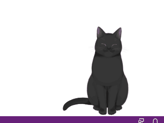
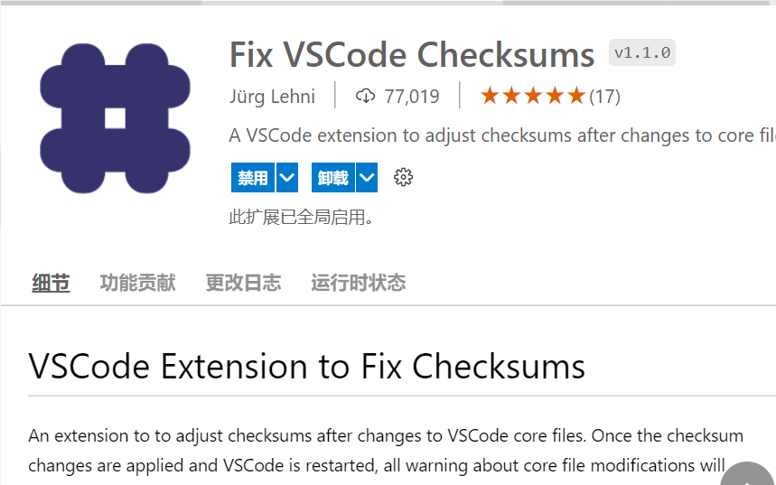

# cats for VSCode
VSCode 摸鱼插件，提供两只喵咪，写代码写累时，可以来快乐的撸撸喵咪，放松一下。


GitHub: https://github.com/zcxiaobao/vscode-cats
<!-- 
VSCode Marketplace: https://marketplace.visualstudio.com/items?itemName=CharlesZ.vscode-live2d

model library: https://github.com/iCharlesZ/vscode-live2d-models -->


<br />

## Preview 预览


<br />

## Install and Uninstall 安装与卸载

需要 VSCode 1.47.0 以上版本才可以安装此插件！

如果是以 System 身份安装的 VSCode，则需要以管理员身份运行 VSCode 才可以正常使用喵咪插件。

如果安装了 node.js 环境，在卸载扩展后一段时候内会执行自动清理删除残留的样式。
如果没有安装 node.js 环境，则卸载前需要手动在设置里将看板娘设置成关闭。或者在 settings.json 中设置 {"vscode-cats.enabled": false}，然后再卸载插件。如果直接删除插件会有遗留。


<br />

## Warning 警告

**本插件是通过修改 VSCode 的 HTML 文件的方式运行。** 所以会在初次安装，或者 VSCode 升级的时候，会出现损坏提示，请选择 【不再提示】。

**如果实在介意此提示请不要安装此扩展！！！**

## 解决【不再提示】警告
因为上述实现方法直接修改 `Vscode` 的 `JavaScript` 文件，重启 `Vscode` 后有可能会有 `code` 文件错误的警告，我们来解决这种情况：
### 方法一
1.  开命令行，安装 `Fix VSCode Checksums`，键入命令：
```
code --install-extension lehni.vscode-fix-checksums
```
2.  打开 `Vscode` ，快捷键 `Ctrl + Shift + P` 输入命令：

```
Fix Checksums:Apply
```
### 方法二
打开 VSCode 扩展搜索 `Fix VSCode Checksums` 插件

<br />

## Extended Settings 扩展设置

|配置 | 描述
|-----|------------
|`vscode-cats.enabled`| true:启用插件、false:禁用插件
|`vscode-cats.model`| 选择喵咪模型
|`vscode-cats.modelWidth`| 自定义喵咪宽度
|`vscode-cats.modelHeight`| 自定义喵咪高度
|`vscode-cats.moveX`| 自定义喵咪水平位置
|`vscode-cats.moveY`| 自定义喵咪垂直位置
|`vscode-cats.opacity`| 设置喵咪透明度
|`vscode-cats.position`| 设置喵咪左右定位

<br />

## Release Notes 版本说明


### 0.0.1 | 2021-11-16

- 预发布


## Thanks 感谢

没有这些开源项目，就不会有这个插件的出现

* [live2d-widget](https://github.com/stevenjoezhang/live2d-widget)
* [vscode-background](https://github.com/shalldie/vscode-background)

<br />

**Enjoy!**
